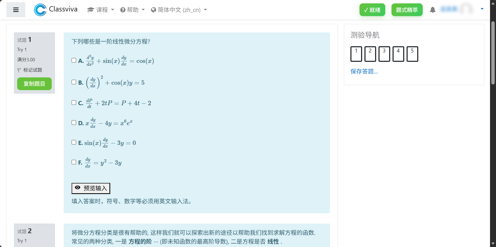
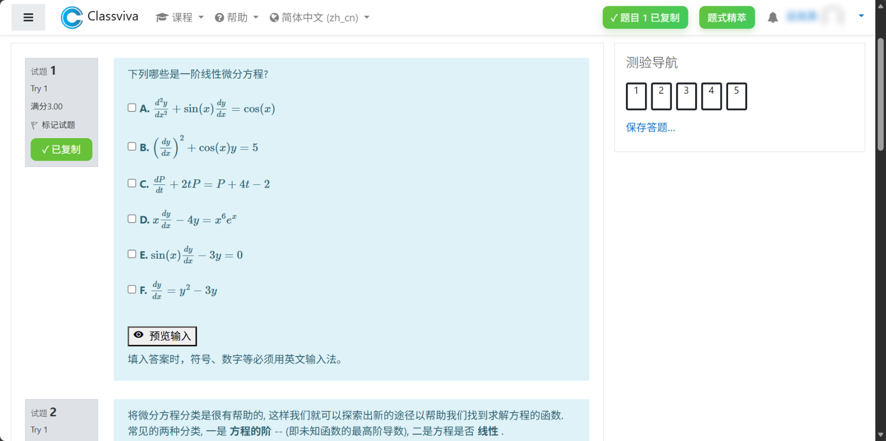
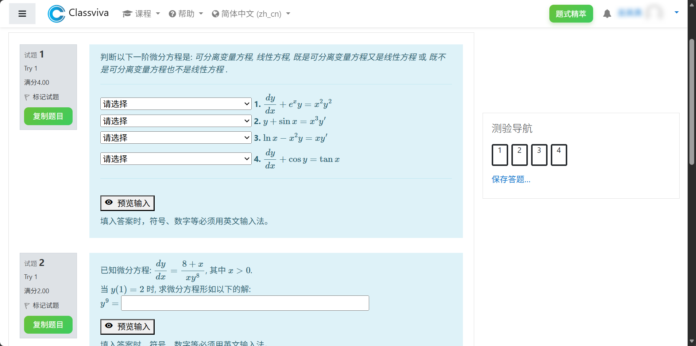

# Classviva Question Helper | 题式精萃

> ***Elegance is not a dispensable luxury but a quality that decides between success and failure!***
> Developed by Wu Qizhen on 2025.12.6
>
> **💡 提示**：如果您在使用过程中遇到任何问题，请在 GitHub Issues 中提交问题，我们会尽快处理！

 

## 🚀 1. 让学习更高效，让 AI 成为您的学习伙伴！

Classviva Question Helper 是一个 Tampermonkey 用户脚本，为 Classviva 学习平台设计。它能智能提取题目内容，处理 LaTeX 数学公式，并提供一键复制功能，让学习者可以轻松将题目内容复制到 AI 工具中进行分析和解答


## 📦 2. 快速演示

- 进入平台自动加载
  

- 点击按钮一键复制

  - 

    - 复制结果：

      ```
      下列哪些是一阶线性微分方程? A. \(\frac{d^2y}{dx^2} + \sin(x)\frac{dy}{dx}=\cos(x)\) B. \(\left(\frac{dy}{dx}\right)^2+\cos(x)y=5\) C. \(\frac{dP}{dt}+2tP = P + 4t -2\) D. \(x\frac{dy}{dx} - 4y = x^6e^x\) E. \(\sin(x)\frac{dy}{dx} - 3y = 0\) F. \(\frac{dy}{dx} = y^2-3y\)
      ```

  - 

    - 复制结果：

      ```
      题目 1：
      判断以下一阶微分方程是: 可分离变量方程, 线性方程, 既是可分离变量方程又是线性方程 或 既不是可分离变量方程也不是线性方程 . 请选择 可分离变量方程 线性方程 既是可分离变量方程又是线性方程 既不是可分离变量方程也不是线性方程 1. \(\displaystyle \frac{dy}{dx}+e^x y = x^2y^2\) 请选择 可分离变量方程 线性方程 既是可分离变量方程又是线性方程 既不是可分离变量方程也不是线性方程 2. \(\displaystyle y + \sin x = x^3 y'\) 请选择 可分离变量方程 线性方程 既是可分离变量方程又是线性方程 既不是可分离变量方程也不是线性方程 3. \(\displaystyle \ln x - x^2 y = x y'\) 请选择 可分离变量方程 线性方程 既是可分离变量方程又是线性方程 既不是可分离变量方程也不是线性方程 4. \(\displaystyle \frac{dy}{dx} + \cos y = \tan x\)
      
      题目 2：
      已知微分方程: \(\displaystyle \frac{dy}{dx} = \frac{8 + x}{xy^{8}}\) , 其中 \(x > 0\) . 当 \(y(1) = 2\) 时, 求微分方程形如以下的解: \(y^{9} =\)
      ```

- 更多
  


## 🌟 4. 主要功能

- ✅ **智能题目提取**：自动识别并提取题目内容，保持格式完整
- ✅ **公式完美处理**：支持行内公式和显式公式，确保 AI 能正确解析
- ✅ **一键复制**：点击按钮即可复制题目内容，无需手动选择
- ✅ **简洁直观的 UI**：与 Classviva 平台无缝集成，不干扰正常学习体验
- ✅ **实时通知**：复制成功时显示友好提示


## 🛠️ 4. 安装与使用

### 1️⃣ 4.1 安装 Tampermonkey 扩展

首先，确保您已安装 Tampermonkey 浏览器扩展：

- [Chrome](https://chrome.google.com/webstore/detail/tampermonkey)
- [Edge](https://microsoftedge.microsoft.com/addons/Microsoft-Edge-Extensions-Home)
- [Firefox](https://addons.mozilla.org/en-US/firefox/addon/tampermonkey)
- [Safari](https://apps.apple.com/us/app/tampermonkey)

### 2️⃣ 4.2 启用开发者模式

在浏览器扩展插件设置中，**启用开发者模式**

### 3️⃣ 4.3 安装 Classviva Question Helper

1. 在 GitHub 仓库页面点击“Code”按钮
2. 选择“Copy”复制整个脚本内容
3. 在 Tampermonkey 控制面板中，点击“新建脚本”（或 “创建新脚本”）
4. 粘贴复制的脚本内容到编辑器中
5. 保存脚本（点击右上角的“保存”按钮）
6. 确保脚本已启用（在 Tampermonkey 控制面板中确认状态为“启用”）

### 4️⃣ 4.4 使用

1. 打开 Classviva 平台（`https://classviva.org` 或 `https://classviva.hkust-gz.edu.cn`）
2. 进入题目列表页面
3. 在每个题目旁边会显示“复制题目”按钮
4. 点击按钮即可一键复制题目内容
5. 粘贴到 AI 工具中进行分析和解答


## 📌 5. 注意事项

- 本脚本仅支持 **Classviva** 平台（`*.classviva.org` 和 `*.classviva.hkust-gz.edu.cn`）
- 确保您的 Classviva 账户已登录
- 需要浏览器扩展插件的**开发者模式**已启用
- LaTeX 公式会被自动转换为标准格式，便于 AI 解析


## 🤝 6. 贡献指南

我们欢迎任何对脚本的改进和优化！如果您想贡献代码：

1. Fork 本仓库
2. 创建您的特性分支（`git checkout -b feature/your-feature`）
3. 提交您的更改（`git commit -am 'Add some feature'`）
4. 推送到您的分支（`git push origin feature/your-feature`）
5. 创建 Pull Request

**请确保在提交前：**

- 保持代码整洁和注释清晰
- 通过测试确保功能正常
- 更新 README 文件（如有必要）


## 📜 7. 许可证

本项目采用 **MIT 许可证**：请参阅 [LICENSE](https://github.com/Wu-Qizhen/ClassvivaQuestionHelper/blob/master/LICENSE) 文件获取详细信息
